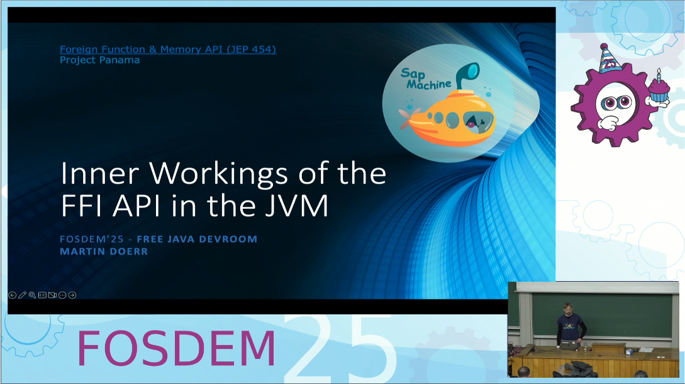

Our team gives many presentations at conferences and meetups all over Europe and elsewhere.
We collect these here.

Johannes Bechberger ([blog](https://mostlynerdless.de))
--------------------------
Johannes Bechberger is a JVM developer working on profilers and their underlying technology in the SapMachine team at SAP. This includes improvements to async-profiler and its ecosystem, a website to view the different JFR event types, and improvements to the FirefoxProfiler, making it usable in the Java world. He started at SAP in 2022 after two years of research studies at the KIT in Java security analyses. His work today comprises many open-source contributions and his blog, where he regularly writes on in-depth profiling and debugging topics. He also works on hello-ebpf, the first eBPF library for Java.

Since 2023, he's been touring Europe's Java User Groups and conferences, like JavaZone and Devoxx Belgium, to speak on various topics.

_All of the following talks are his._

Unleash the power of Open-Source Java Profilers
-------
_Alternative titles: Profiler Tools for Java | Your Java Application Is Slow? Check Out These Open-Source Profilers_

Profilers help to analyze performance bottlenecks of your application –  if you know which to use and how to work with them.

There are many open-source profilers, like async-profiler or JMC. This talk will give you insights into these tools, focusing on understanding the basic concepts of profiling like flame graphs and more, the usage of async-profiler and JMC, and the advantages and disadvantages of the different tools.

The talk will end with personal insights into my profiler development and a successful profiling workflow that resulted from this.
https://speakerdeck.com/parttimenerd/unleash-the-power-of-open-source-java-profilers

_[Collection of reading material](https://mostlynerdless.de/profiling-talks/)_

Date    | Event    |  Location   | Links
--------|----------|-------------|--------
Apr 25, 2024 | [JUG Berlin-Brandenburg](https://www.meetup.com/de-DE/jug-bb/) | Berlin, Germany | [Schedule](https://www.meetup.com/de-DE/jug-bb/events/300367356/)
Nov 21 - 23, 2023 | [JCon World](https://2023.world.jcon.one/) | Online | [Schedule](https://sched.co/1RRZ7)
Oct 18 - 19, 2023 | [Basel One](https://baselone.ch/one) | Basel, Switzerland | [Schedule](https://baselone.ch/speech.html?id=771854C5-8D91-4397-8F2D-BDC421D3CD61)
Sep 12, 2023 | [JavaForum Nord](https://javaforumnord.de/2023/programm/) | Hannover, Germany | [Schedule](https://javaforumnord.de/2023/programm)
Sep 6 - 7, 2023 | [JavaZone](https://2023.javazone.no) | Oslo, Norway | [Schedule](https://2023.javazone.no/program/d69ca0c0-fbce-4a36-8f92-21b39456c0bd), [Recording](https://vimeo.com/861946709), [Slides](https://speakerdeck.com/parttimenerd/unleash-the-power-of-open-source-java-profilers)
Jun 14, 2023 | [Karlsruher Entwicklertag](https://entwicklertag.de/) | Karlsruhe, Germany |
Jun 7, 2023 | [JDriven Full Stack Conference](https://jdriven.com/full-stack-conference-2023) | Nieuwegen, Netherlands |
May 31, 2023 | [JUG Milano](http://www.jugmilano.it/meeting-145.html) | Milan, Italy | [Schedule](http://www.jugmilano.it/meeting-145.html), [Recording](https://www.youtube.com/watch?time_continue=350&v=DhYDzff6UCE)
Mar 27 - 29, 2023 | [QCon London](https://qconlondon.com/recap/mar2023) | London, UK | [Schedule](https://qconlondon.com/presentation/mar2023/your-java-application-slow-check-out-these-open-source-profilers), [Recording](https://www.infoq.com/presentations/profilers-open-source)
Oct 18, 2022 | [JUG Karlsruhe](https://jug-karlsruhe.de) | Karlsruhe, Germany | [Schedule](https://jug-karlsruhe.de/content/java-profiling-tools/), [Recording](https://www.youtube.com/watch?v=Fglxqjcq4h0)

Writing a Java Profiler in Pure Java
------
_Alternative title: Write your own Java Profiler in 240 lines of pure Java_

Profilers help to analyze performance bottlenecks of your application if you know how to use them. Getting to grips with profilers helps to understand how they work: Profilers aren't rocket science. A usable Java profiler can be written in 240 lines of pure Java code, allowing you to fix performance issues and add custom features quickly.

This talk will give the fundamentals of Java profiling and how Java profilers typically work, followed by a detailed explanation of how to develop a functioning profiler in a few lines of Java code. This talk will also explain how you can use it in production to analyze performance issues and show briefly how to work with a widely used open-source profiler based on the same principles.

_[Collection of reading material](https://mostlynerdless.de/profiling-talks/)_

Date    | Event    |  Location   | Links
--------|----------|-------------|--------
Jun 28, 2024 | [KCDC](https://www.kcdc.info/) | Kansas City, US | [Schedule](https://www.kcdc.info/sessions)
May 29, 2024 | [jPrime](https://jprime.io/) | Sofia, Bulgaria | [Schedule](https://jprime.io/agenda/202)
Apr 4, 2024 | [JUG Vilnius](https://vilnius-jug.lt/) | Vilinus, Lithuania | [Schedule](https://www.facebook.com/events/1588857285210518)
Feb 21 - 23, 2024 | [ConFoo](https://confoo.ca/en/2024) | Montreal, Canada | [Schedule](https://confoo.ca/en/2024/session/writing-a-java-profiler-in-pure-java)
Nov 9, 2023 | [J-Fall](https://jfall.nl) | Ede, Netherlands | [Recording](https://www.youtube.com/watch?v=R1wJEhifkEo)
Oct 2 - 6, 2023 | [Devoxx Belgium](https://devoxx.be/2023-schedule/) | Antwerp, Belgium | [Schedule](https://devoxx.be/talk/?id=39109), [Slides](https://speakerdeck.com/parttimenerd/write-your-own-java-profiler-in-240-lines-of-pure-java), [Recording](https://www.youtube.com/watch?v=Mxcp2khJ4fw)
Sep 14 - 15, 2023 | [code.talks](https://codetalks.de/) | Hamburg, Germany | [Schedule](https://codetalks.de/program#talk-1748?event=8), [Recording](https://www.youtube.com/watch?v=ihD_Cz3sK9I)
Jul 13, 2023 | [JUG Mannheim](http://www.majug.de) | Mannheim, Germany | [Schedule](http://www.majug.de/2023/07/13/writing-a-java-profiler/)
Jun 14, 2023 | [Karlsruher Entwicklertag](https://entwicklertag.de/) | Karlsruhe, Germany| _C++ Version with the title "Writing a Java Profiler from Scratch"_
Jun 5, 2023 | [OpenValue München](https://www.meetup.com/openvaluemuenchen) | Munich, Germany | [Schedule](https://www.meetup.com/openvaluemuenchen/events/293736106/)

Do you trust profilers? I once did too
------------

Profilers are great tools in your toolbox, like debuggers, when solving problems with your Java application. I'll tell you some of their problems and a technique to cope with them in this talk.

There are many open-source profilers, most notably JFR/JMC, and async-profiler, that help you to find and fix performance problems. But they are just software themself, interwoven with a reasonably large project, the OpenJDK (or OpenJ9, for that matter), and thus suffer from the same problems as the typical problems of application they are used to profile.

_[Related blog post](https://mostlynerdless.de/blog/2023/02/20/do-you-trust-profilers-i-once-did-too/)_

Date    | Event    |  Location   | Links
--------|----------|-------------|--------
Feb 26 - 28, 2025 | [ConFoo](https://confoo.ca/en/2025) | Montreal, Canada | [Schedule](https://confoo.ca/en/2025/session/do-you-trust-profilers-i-once-did-too)
Jun 8 - 11, 2023 | [Gulaschprogrammiernacht](https://entropia.de/GPN21) | Karlsruhe, Germany | [Schedule](https://cfp.gulas.ch/gpn21/talk/VFBQ88/), [Slides](https://speakerdeck.com/parttimenerd/do-you-trust-profilers-i-once-did-too), [Recording](https://www.youtube.com/watch?v=6DbjSN-nCcY)

Instrument to Remove: Using Java agents for fun and profit
-------
I'll present you with all the techniques to write a Java agent and javassist based instrumentation code to find unused classes and dependencies in your project. Knowing which classes and dependencies are not used in your application can save you from considering the bugs and problems in these dependencies and classes if you remove them, helping to guard against supply chain attacks.

Java agents and instrumentation of a few lines of code can save you a lot of effort and implementing them is great fun :)

_Reading material: [Instrumenting Java Code to Find and Handle Unused Classes](https://mostlynerdless.de/blog/2023/04/06/instrumenting-java-code-to-find-and-handle-unused-classes/) and [Class Loader Hierarchies](https://mostlynerdless.de/blog/2023/06/02/class-loader-hierarchies/)_

Date    | Event    |  Location   | Links
--------|----------|-------------|--------
Jul 31, 2024 | [Java Forum Stuttgart](https://www.java-forum-stuttgart.de/) | Stuttgart, Germany | [Schedule](https://www.java-forum-stuttgart.de/vortraege/instrument-to-remove/), [Slides](https://speakerdeck.com/parttimenerd/instrument-to-remove-javaforum-stuttgart-2024)
Mar 7, 2024 | [Voxxed Days Zürich](https://voxxeddays.com/zurich/) | Zürich, Switzerland | [Schedule](https://voxxeddays.com/zurich/schedule/talk/?id=1754), [Slides](https://speakerdeck.com/parttimenerd/instrument-to-remove-voxxeddays-zurich-2024), [Recording](https://www.youtube.com/watch?v=JnJgvcZo7b8)
Jun 8 - 11, 2023 | [Gulaschprogrammiernacht](https://entropia.de/GPN21) | Karlsruhe, Germany | [Schedule](https://cfp.gulas.ch/gpn21/talk/QJ8DYB/), [Slides](https://speakerdeck.com/parttimenerd/instrument-to-remove-using-java-agents-for-fun-and-profit), [Recording](https://www.youtube.com/watch?v=3cjDdXTKe1M)

Debugging Unveiled: Exploring Debugger Internals and Hidden Gems
-------
_Alternative title: Debugging Unveiled: Exploring Debugger Internals to Make You a Better Developer_

​​Debuggers are indispensable tools for Java developers, empowering them to conquer bugs and unravel complex systems. But have you ever wondered how they work? Curious about the implementation of features like conditional breakpoints and remote debugging? Wondering about all the cool features in modern IDEs, how they are implemented and how IDEs even communicate with your JVM?

Join me for a deep dive into debuggers, unlocking their secrets and hidden gems to maximize their potential.

_Reading material: [Debugging-related blog posts](https://mostlynerdless.de/blog/tag/jdwp/), [JDWP-tunnel](https://github.com/parttimenerd/jdwp), [Personal talk page](https://mostlynerdless.de/java-debugging-talk/)_

Date    | Event    |  Location   | Links
--------|----------|-------------|--------
Jul 2, 2024 | [NYJavaSIG](https://www.javasig.com/) | New York City, USA | [Schedule](https://nyjavasig.groups.io/g/main/topic/july_2_tues_exploring/106850746)
Jun 3 - 5, 2024 | [Karlsruher Entwicklertag](https://entwicklertag.de/) | Karlsruhe, Germany | [Schedule](https://entwicklertag.de/programm/Debugging%20Unveiled:%20Exploring%20Debugger%20Internals%20and%20Hidden%20Gems) 
Apr 9 - 11, 2024 | [JavaLand](https://javaland.eu) | Nürburgring, Germany | Deep-Dive, [Schedule](https://meine.doag.org/events/javaland/2024/agenda/#eventDay.all#textSearch.Debugging%20Unveiled)
Feb 21 - 23, 2024 | [ConFoo](https://confoo.ca/en/2024) | Montreal, Canada | [Schedule](https://confoo.ca/en/2024/session/exploring-debugger-internals-to-make-you-a-better-developer)
Jan 17, 2024 | [WeAreDevelopers Java Day](https://www.wearedevelopers.com/event/java-developer-day-january-2024) | Online | [Schedule](https://www.wearedevelopers.com/event/java-developer-day-january-2024)
Nov 7, 2023 | [JUG Karlsruhe](https://jug-karlsruhe.de/) | Karlsruhe, Germany | [Schedule](https://jug-karlsruhe.de/content/debugging/), [Slides](https://speakerdeck.com/parttimenerd/debugging-unveiled)
Oct 12, 2023 | [JUG Darmstadt](https://www.jug-da.de/) | Darmstadt, Germany | [Schedule](https://www.jug-da.de/2023/10/Debugging-Unveiled/), [Slides](https://speakerdeck.com/parttimenerd/debugging-unveiled-exploring-debugger-internals-to-make-you-a-better-developer)

Building a Lightning Fast Firewall with Java & eBPF
---------
eBPF is buzzing all over the cloud native world, as the cutting-edge technology reshaping the way we understand performance, security, and observability within kernel space. Java, with its recent strides in modernization and optimization, from enhancing startup times to facilitating native execution and advancing machine learning applications, stands at the cusp of this transformative era.

Join us in this journey, where we will embark on an ambitious challenge to write and build a high-throughput firewall leveraging the combined power of eBPF and Java. We'll start with a deep dive into eBPF's capabilities for kernel-level packet manipulation, then transition to how Java's latest advancements, particularly through Project Panama, enable seamless native code invocation and interoperability. Our focus will then converge to a hands-on demonstration of building a simple firewall using eBPF and Java, integrating kernel-level operations with high-level programming for real-time performance enhancements. 

Attendees will gain practical insights into deploying eBPF programs from Java using the hello-ebpf library, managing packet flows efficiently, and implementing firewall rules with precision, leveraging the strengths of both worlds.

_Reading material: My [blog series](https://github.com/parttimenerd/hello-ebpf) on developing [hello-ebpf](https://mostlynerdless.de/blog/tag/hello-ebpf/), a Java library for eBPF. More resources [here](https://gist.github.com/parttimenerd/333709035aab9734df8db1721708afc3)_

Date    | Event    |  Location   | Links
--------|----------|-------------|--------
Jan 20 - 23, 2025 | [NDC Security](https://ndc-security.com/) | Oslo, Norway | [Schedule](https://ndc-security.com/agenda/building-a-lightning-fast-firewall-with-java-and-ebpf-0tjj/0pbcs4nkx7s)
Nov 6 - 8, 2024 | [Øredev](https://oredev.org/) | Malmö, Sweden | [Schedule](https://oredev.org/program), joint talk with Mohammed Aboullaite, [Recording](https://www.youtube.com/watch?v=fhioB5DSh14&list=PLOUKmSqExtAFpg3krEd6CXr3uIyUgP97b)
Oct 22 - 24, 2024 | [Open Community Experience](https://www.ocxconf.org) | Mainz, Germany | [Schedule](https://www.ocxconf.org/event/778b82cc-6834-48a4-a58e-f883c5a7b8c9/websitePage:26bc9d91-446a-49e1-9f08-8fcc4680073e?session=ed8d65e0-96c7-433e-bd78-bf42a77ef9f4)
Oct 7 - 11, 2024 | [Devoxx Belgium](https://devoxx.be) | Antwerp, Netherlands | [Schedule](https://devoxx.be/talk/?id=16063), joint talk with Mohammed Aboullaite, [Recording](https://www.youtube.com/watch?v=bbvDK4U9cqI)
Sep 26 - 27, 2024 | [InfoQ Dev Summit](https://devsummit.infoq.com/conference/munich2024) | Munich, Germany | [Schedule and Recording](https://devsummit.infoq.com/presentation/munich2024/building-lightning-fast-firewall-java-ebpf)
Sep 3 - 5, 2024 | [JavaZone](https://2024.javazone.no/) | Oslo, Norway | [Schedule](https://2024.javazone.no/program/60571529-7dcf-4613-9441-361cdb50545e), [Slides](https://speakerdeck.com/parttimenerd/building-a-lightning-fast-firewall-with-java-and-ebpf-javazone-2024), [Recording](https://vimeo.com/1006550543), joint talk with Mohammed Aboullaite
Aug 28, 2024 | [Copenhagen Developer Festival](https://cphdevfest.com) | Copenhagen, Denmark | [Schedule](https://cphdevfest.com/agenda/build-a-lightning-fast-firewall-with-java-and-ebpf-0p8u/0bsmnwzqrzp), [Recording](https://www.youtube.com/watch?v=WYwHiDyMK68)
Aug 23, 2024 | [Suisse JUG](https://jug.ch) | Luzern, Switzerland | [Schedule](https://www.jug.ch/html/events/2024/fast_firewall_with_java_and_ebpf_lu.html), [Slides](https://www.jug.ch/events/slides/240822_Firewalls_in_eBPF.pdf)
Aug 22, 2024 | [Suisse JUG](https://jug.ch) | Zürich, Switzerland | [Schedule](https://www.jug.ch/html/events/2024/fast_firewall_with_java_and_ebpf_zh.html), [Slides](https://www.jug.ch/events/slides/240822_Firewalls_in_eBPF.pdf)

Sound of Scheduling: Writing Linux Schedulers in Java with eBPF
-------
eBPF is transforming Linux system capabilities, enabling the extension of  the kernel with custom process schedulers, firewalls, and more. Thanks to Java's recent native integration and a bit of compiler magic, we can now create these extensions directly in Java — and that's exactly what this talk is all about.

We'll cover the fundamentals of eBPF and scheduling and how to implement a custom scheduler in Java. The session will showcase a scheduler that visualizes scheduling through sound —  each process is mapped to a musical note, offering a fun and intuitive way to understand system activity. You’ll even get the chance to control the scheduling yourself using a MIDI keyboard.

Join us to learn how to craft small eBPF programs in Java that you'll really like the sound of.

Date    | Event    |  Location   | Links
--------|----------|-------------|--------
Jun 19 - 22, 2025 | [Gulaschprogrammiernacht](https://entropia.de/GPN23) | Karlsruhe, Germany | 
May 7, 2025 | [JUG Karlsruhe](https://jug-karlsruhe.de) | Karlsruhe, Germany | [Schedule](https://jug-karlsruhe.de/content/sounds-of-scheduling/), joint talk with David Kiefer
Jan 20, 2025 | [Java Forum Malmö](https://foocafe.org/group/java-forum-malmo) | Malmö, Sweden | [Schedule](https://foocafe.org/event/sound-scheduling-writing-linux-schedulers-java-ebpf), [Slides](https://speakerdeck.com/parttimenerd/sound-of-scheduling-writing-linux-schedulers-in-java-with-ebpf)

### Who Instruments the Instrumenters?
_Alternative title: Who Instruments the Instrumenters? A Practical Look at Class Generation and Transformation in Java_

Ever wonder how libraries like Spring, Mockito, and JaCoCo add arbitrary behavior to existing objects or even modify them altogether? We'll demystify class generation and transformation in Java and explore how the JVM allows us to dynamically generate and modify code for instrumentation.

We do this by instrumenting the code that instruments the code itself, so we can observe how, for example, Mockito alters the code to implement mocking.

Through concrete examples from real-world applications, we'll uncover how these techniques enhance and instrument Java code, from creating dynamic proxies to altering bytecode at runtime. You'll gain an inside look at decompiled bytecode to understand the magic behind the scenes.

By the end of this session, you'll see how Java agents and instrumentation can streamline your development process and make code manipulation both effective and enjoyable.

Date    | Event    |  Location   | Links
--------|----------|-------------|--------
Apr 3, 2025 | [VoxxedDays Amsterdam](https://amsterdam.voxxeddays.com/) | Amsterdam, Netherlands | [Schedule](https://amsterdam.voxxeddays.com/talk/?id=4340)

Non-Java Presentations
-----------

## Python 3.12's new monitoring and debugging API

Python 3.12 introduced a new low impact monitoring API with [PEP669](https://peps.python.org/pep-0669/) which can be used to implement far faster debuggers than ever before. This talk will give you an introduction to the new API and show you how it can be used to write a simple debugger from scratch.

Date    | Event    |  Location   | Links
--------|----------|-------------|--------
Oct 31 - Nov 3, 2024 | [PyCon France](https://www.pycon.fr/2024/) | Strasbourg, France | [Schedule](https://www.pycon.fr/2024/en/talks/long-talk.html#talk-YFKQHF)
Sep 25 - 26, 2024 | [PyData Paris](https://pydata.org/paris2024/) | Paris, France | [Schedule](https://pydata.org/paris2024/schedule#session/ZQTCPC/), [Recording](https://www.youtube.com/watch?v=H90Sf5L_FHE)
Apr 22 - 24, 2024 | [PyCon.DE](https://2024.pycon.de/) | Berlin, Germany | [Schedule](https://pretalx.com/pyconde-pydata-2024/talk/P7AG9A/) [Slides](https://speakerdeck.com/parttimenerd/python-3-dot-12-s-new-monitoring-and-debugging-api-pyconde-2024)
Feb 3 - 4, 2024 | [FOSDEM](https://fosdem.org/2024/) | Brussels, Belgium | [Schedule with Recording](https://fosdem.org/2024/schedule/event/fosdem-2024-1678-python-3-12-s-new-monitoring-and-debugging-api/), [Slides](https://speakerdeck.com/parttimenerd/python-3-dot-12-s-new-monitoring-and-debugging-api)

## Let’s create a Python Debugger together

Python long lagged a good monitoring and profiling API. It had only the simplistic sys.settrace API, which had a high overhead and couldn't be configured appropriately. The new API, released in October 2023, will change this by offering a proper fine-grained and well-designed monitoring API while also making the commonly used operations fast.

This talk will give you an introduction to the new API and its design major design decisions and show you how you can use it to write a simple debugger from scratch.

Date    | Event    |  Location   | Links
--------|----------|-------------|--------
Feb 26 - 28, 2025 | [ConFoo](https://confoo.ca/en/2025) | Montreal, Canada | [Schedule](https://confoo.ca/en/2025/session/do-you-trust-profilers-i-once-did-too)
May 31, 2024 | [Gulaschprogrammiernacht](https://entropia.de/GPN22) | Karlsruhe, Germany | [Schedule](https://cfp.gulas.ch/gpn22/talk/DH3EHM/)
May 2, 2024 | [budapest.py](https://www.meetup.com/budapest-py) | Budapest, Hungary | [Event](https://www.linkedin.com/feed/update/urn:li:activity:7189168308217139201/), [Interview](https://www.linkedin.com/feed/update/urn:li:activity:7193147113516523520/)
Apr 4, 2024 | [PyCon Lithuania](https://pycon.lt/2024/talks/KPAPX8) | Vilnius, Lithuania | [Schedule](https://pycon.lt/2024/talks/KPAPX8), [Slides](https://speakerdeck.com/parttimenerd/lets-create-a-python-debugger-together-pyconlt-2024), [Recording](https://www.youtube.com/watch?v=2AWZuFPoIpI) 

## Writing a Minimal Scheduler with eBPF, sched_ext, and C

Today, eBPF is used for software-defined networking, observability, monitoring tools, and more. Previously, creating these was labor-intensive and had a high barrier to entry. With the new scheduler extensions, we can now add custom schedulers to this list. Sched_ext allows us to write schedulers with custom policies directly in eBPF. In this talk, we’ll develop a basic FIFO (First-In-First-Out) scheduler in C to show you how to get started with writing your own. If you’re interested in diving deeper into eBPF, join us for a quick hands-on intro to custom scheduling!

Date    | Event    |  Location   | Links
--------|----------|-------------|--------
Mar 22 - 23, 2025 | [Chemnitz Linux Days](https://chemnitzer.linux-tage.de/2025/en) | Chemnitz, Germany | [Schedule](https://chemnitzer.linux-tage.de/2025/en/programm/beitrag/221), [Recording](https://media.ccc.de/v/clt25-221-writing-a-minimal-scheduler-with-ebpf-sched_ext-and-c), [Slides](https://speakerdeck.com/parttimenerd/writing-a-minimal-scheduler-with-ebpf-sched-ext-and-c)
Feb 1 - 2, 2025 | [FOSDEM](https://archive.fosdem.org/2025/) | Brussels, Germany | [Schedule and Recording](https://fosdem.org/2025/schedule/event/fosdem-2025-4458-writing-a-minimal-scheduler-with-ebpf-schedext-and-c/)

### hello-ebpf: Writing eBPF programs directly in Java

While there are eBPF libraries for languages like Rust and Go, there are none for Java, one of the most popular programming languages. We developed the hello-ebpf Java library to change this. Its aim is to integrate eBPF programs seamlessly into Java applications, making it possible to write the eBPF programs themselves directly in Java.

In this talk, we show the technology behind the library, its use, and how to use it to easily implement a basic packet filter and a simple Linux scheduler without writing a single line of C code.

Date    | Event    |  Location   | Links
--------|----------|-------------|--------
May 12 - 15, 2025 | [JCon Europe](https://2025.europe.jcon.one/) | Cologne, Germany | [Schedule](https://schedule.jcon.one/session/771555), [Slides](https://speakerdeck.com/parttimenerd/hello-ebpf-writing-ebpf-programs-directly-in-java-6e325b19-2c79-45cc-9b88-d938978ff5f2)
Sep 18 - 20, 2024 | [Linux Plumbers Conference](https://lpc.events/event/18/) | Vienna, Austria | [Recording](https://www.youtube.com/watch?v=bWs5GHYpYxg)

One-off Short Presentations by Johannes Bechberger
------------

### [Inner Workings of Safepoints](https://fosdem.org/2024/schedule/event/fosdem-2024-1675-inner-workings-of-safepoints/)
_Feb 3 - 4, 2024; [FOSDEM](https://fosdem.org/2024/); Brussels, Belgium_

A Java thread in the JVM regularly checks whether it should do extra work besides the execution of the bytecode. This work is done during so-called safepoints. There are two types of safepoints: local and global. This allows the JVM to do activities like method deoptimizations or stop-the-world garbage collections, where the amount of concurrency should be limited. But how do they actually work?

This talk covers the implementation of global and local safepoints in the OpenJDK.

[Slides](https://speakerdeck.com/parttimenerd/inner-workings-of-safepoints)

### [Firefox Profiler beyond the web](https://fosdem.org/2023/schedule/event/mozilla_firefox_profiler_beyond_the_web/)

_Feb 4 - 5, 2023; [FOSDEM](https://archive.fosdem.org/2023/); Brussels, Belgium_ 

Like many programming communities, the Java community lacks a simple open-source profiling UI. In the quest to build such a UI, I found the Firefox Profiler to be the closest to an adaptable polyglot profiling UI. This talk presents my Java JFR Profiler plugin for IntelliJ and gives an overview of how to adapt and integrate the Firefox Profiler to use it to view profiling data from different sources, like JDK Flight Recordings.

This talk is based on my blog posts [Firefox Profiler beyond the web](https://mostlynerdless.de/blog/2023/01/31/firefox-profiler-beyond-the-web/) and [Using Firefox Profiler beyond the web](https://mostlynerdless.de/blog/2023/02/02/using-firefox-profiler-beyond-the-web/) which cover my work on my [Firefox Profiler based IntelliJ Plugin](https://plugins.jetbrains.com/plugin/20937-java-jfr-profiler).

### [AsyncGetStackTrace](https://fosdem.org/2023/schedule/event/asyncgetstacktrace_the_improved_version_of_asyncgetcalltrace_jep_435/)
_Feb 4 - 5, 2023; [FOSDEM](https://archive.fosdem.org/2023/); Brussels, Belgium_ 

Java profiling relies heavily on the AsyncGetCallTrace API. But this API has major drawbacks: It is unofficial, not well-tested, and omits important information. I propose AsyncGetStackTrace (JEP Candidate 435) as an improved replacement.

This talk will give an overview of AsyncGetCallTrace and AsyncGetStackTrace, their implementations, differences, and use cases, it is based on my blog post [AsyncGetStackTrace: A better Stack Trace API for the JVM](https://mostlynerdless.de/blog/2023/01/19/asyncgetstacktrace-a-better-stack-trace-api-for-the-jvm/) and related to the [JEP Candidate 435](https://openjdk.org/jeps/435).

/asyncgetstacktrace_the_improved_version_of_asyncgetcalltrace_jep_435.webm?_=1)

### [Writing a Linux scheduler in Java with eBPF](https://ebpf.io/summit-2024-schedule/)
_Sep 11, 2024; [eBPF Summit](https://ebpf.io/summit-2024-schedule/); Online_

Sched_ext allows you to write a Linux scheduler with eBPF. Now that it finally comes to the mainline kernel, we want to make it accessible to a new group of people: Java developers. With our prototypical hello-ebpf library, it's now possible to write Linux schedulers and more using Java.

Join me in learning about sched_ext and how to write a basic scheduler implementation in "pure" Java.

### [Concurrency Testing using Custom Linux Schedulers](https://fosdem.org/2025/schedule/event/fosdem-2025-4489-concurrency-testing-using-custom-linux-schedulers/)
_Feb 1 - 2, 2025; [FOSDEM](https://archive.fosdem.org/2025/); Joint talk with Jake Hillion; Brussels, Belgium_

Consider you have a concurrency bug that requires threads to run in a specific order. Wouldn't it be great if you could stop and start threads at random? Prevent them from being scheduled onto the CPU? And the best part: Without the application being able to prevent this, like it could do with POSIX STOP and START signals? In come the scheduler extensions for the Linux Kernel. Introduced in version 6.12, they allow you to quickly write your own schedulers with eBPF, and can be the base for simple libraries that enable you to start and stop threads directly in the Linux kernel. This opens the possibility of creating complex scheduler scenarios at a whim.

In this talk, we'll show you a prototypical sched_ext-based library for concurrency testing.

### [Advancing Java Profiling: Achieving Precision and Stability with JFR , eBPF and user context](https://fosdem.org/2025/schedule/event/fosdem-2025-4848-advancing-java-profiling-achieving-precision-and-stability-with-jfr-ebpf-and-user-context/)
_Feb 1 - 2, 2025; [FOSDEM](https://archive.fosdem.org/2025/); Joint talk with Jaroslav Bachorik; Brussels, Belgium_

Java developers struggle with the trade-off between precise profiling and application stability. Unofficial methods like AsyncGetCallTrace offer precision but risk crashes, while official APIs such as JVMTI, JMX, and StackWalker are stable but biased due to safepoint polling. Java Flight Recorder (JFR) reduces this bias but introduces interpolation errors.

This talk addresses these challenges with three key topics: • Combining precise sampling with JFR’s stability to remove biases without sacrificing reliability. • Using eBPF probes and examining JVM internals for safer, detailed profiling. • Enhancing precision with user-supplied profiling contexts.

We will review the history of Java profilers and discuss the future of JVM profiling, with a focus on CPU profiling. Attendees will gain insights into new methods aimed at achieving accurate, stable performance analysis in Java applications, comparing them with async-profiler and existing tools.

## [Inner Workings of the FFI API in the JVM](https://fosdem.org/2025/schedule/event/fosdem-2025-5647-inner-workings-of-the-ffi-api-in-the-jvm/) by Martin Dörr
_Feb 1 - 2, 2025; [FOSDEM](https://archive.fosdem.org/2025/); Brussels, Belgium_

The Foreign Function & Memory API (JEP 454) introduced a new way of interacting with libraries written in other languages. It can be used as replacement for JNI. This talk examines the inner workings of the Foreign Function Interface (FFI) API. After having it implemented for PowerPC, I'd like to discuss how the JVM handles native function calls and Java callbacks, focusing on key concepts like stack layouts, calling conventions, and cross-platform challenges. The session is intended for developers curious about the technical foundations of free and open Java technologies and how JVM enhancements like the FFI API are realized. It will shed light on the low-level mechanisms that enable seamless integration of Java with native code while maintaining the performance and safety Java developers expect.

## [Rumble in the Java Jungle](https://archive.fosdem.org/2019/schedule/event/java_jungle/) by [Volker Simonis](https://archive.fosdem.org/2019/schedule/speaker/volker_simonis/)

_Feb 2 - 3, 2019; [FOSDEM](https://archive.fosdem.org/2019/); Brussels, Belgium_

OracleJDK, OpenJDK, AdoptOpenJDK, OpenJ9, Zulu, IcedTea, Liberica, SapMachine, GraalVM, SubstrateVM. 8, 9, 10, 11, 12, 18.3, 18.9, short-term, mid-term, long-term support release, security updates. GPLv2, Classpath Exception, Oracle Binary Code License, Technology Network License Agreement. Field of use restriction, private and commercial use, reference implementation, substantially derived, TCK/JCK, Oracle Contribution Agreement, OpenJDK Community TCK License Agreement (OCTLA), Java Community Process (JCP), Java Specification Request (JSR), Java Enhancement Proposal (JEP), Preview Features, Incubator Modules, Java (TM), Java SE compatibility, OpenJDK trademark notice.

Confused? Come and hear from Java and OpenJDK veteran Volker Simonis how the Java world has been radically turned inside out in the last year and how this impacts you as a Java user or developer. After the talk you'll have a clear understanding what's going on in the Java ecosystem and you'll be ready to plan your or your companies future Java strategy.
